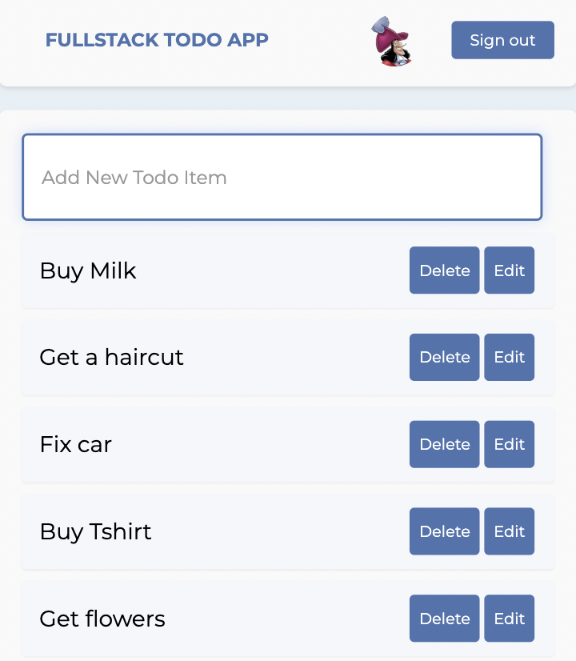

# Full stack todo app

This full stack web application demonstrates complete CRUD (Create, Read, Update, Delete) functionality. The backend is built with Express, utilising JWT and OAuth for authentication. Data management is handled by Knex as the ORM with a SQLite3 database.

The frontend leverages React for building the user interface, with TypeScript for type safety. Styling is managed with Sass, and the application integrates tanstack/react-query for server state management and data fetching.

